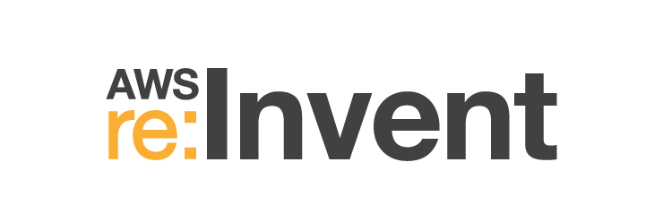
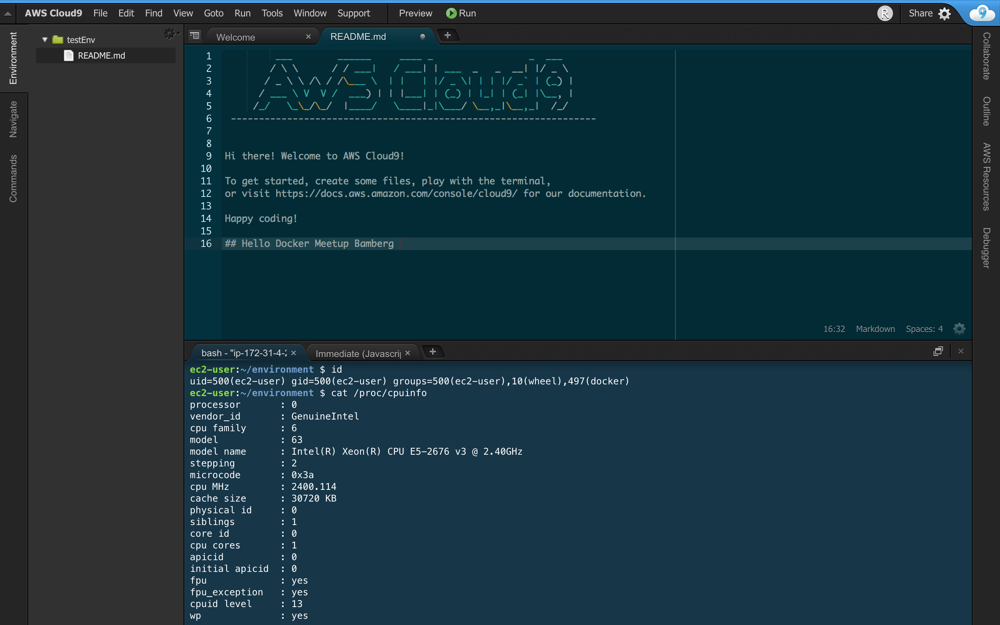

<section data-state="no-title-footer">
<!-- .slide: data-background="images/back_title.jpg" -->

## Recap 2017 
### Docker Meetup Bamberg 

 Govinda Fichtner, Chief Cloud Architect at Paessler AG 

 Bjoern Pohl, Senior Systems Engineer at Paessler AG

---

## AWS re:invent 2017 

<!-- .slide: data-background="images/campusmap.jpg" -->
* Biggest Conference regarding Cloud 
* took place in Las Vegas
* over 1.000 breakout sessions
* over 50.000 visitors 
* 5 days, 2 keynotes, too many parties to count

Note: talk about places etc

---

## Impressions

---
<!-- .slide: data-background="images/registration.jpg" -->
---
<!-- .slide: data-background="images/awswall.jpg" -->
---
<!-- .slide: data-background="images/floodedfloors.jpg" -->
---
<!-- .slide: data-background="images/floor.jpg" -->
---
<!-- .slide: data-background="images/rooms.jpg" -->
---
<!-- .slide: data-background="images/replay1.jpg" -->
---
<!-- .slide: data-background="images/replay5.jpg" -->
---
<!-- .slide: data-background="images/tao.jpg" -->
---
<!-- .slide: data-background="images/replay3.jpg" -->
---
<!-- .slide: data-background="images/tiship.jpg" -->
---
<!-- .slide: data-background="images/vegas1.jpg" -->
---
<!-- .slide: data-background="images/casino.jpg" -->
---
## Announcements

---

### Compute

* New instance types
  * m5 - multi purpose instances<!-- .element: class="fragment" data-fragment-index="1" -->
  * h1 - high throughput, with ssd <!-- .element: class="fragment" data-fragment-index="2" -->
  * i3.metal - bare metal instances<!-- .element: class="fragment" data-fragment-index="3" -->

* AWS Fargate<!-- .element: class="fragment" data-fragment-index="4" -->
  * simplified container deployment<!-- .element: class="fragment" data-fragment-index="5" -->

* AWS EKS<!-- .element: class="fragment" data-fragment-index="6" -->
  * AWS managed Kubernetes<!-- .element: class="fragment" data-fragment-index="7" -->

---

## Storage

* S3 Select
* Glacier Select
  * Only retrieve the Data you actually need
* both can use standard SQL Statements to preselect data

---

## IOT

* AWS FreeRTOS
  * based on FreeRTOS
* IOT Device Management
  * Manage IOT things at scale
* AWS IOT Analytics
* AWS IOT 1-Click
  * assign simple actions to devices
  * can trigger Lambda functions

---

## Machine Learning

* AWS DeepLens
  * Machine Learning enabled camera
* AWS Comprehend
* AWS Rekognition Video
  * Face detection, recognition
* AWS SageMaker
  * simplified Machine Learning
* AWS Translate
  * Language Translation
* AWS Transcribe
  * Speech-to-text

---

## Databases

* AWS Aurora Serverless
* AWS Neptune
* AWS DynamoDB now with global Tables
* On-Demand backups for DynamoDB

---

## Analytics

* AWS Kinesis Video Streams

---

## Security, Identity and Compliance

* AWS GuardDuty

---

## Networking and Content delivery

* PrivateLink

---

## Mobile Services

* AWS AppSync

---

## Media Services

* AWS Elemental
  * encode Media in the cloud

---

## Augmented Reality / VR

* AWS Sumerian

---

## Application Integration

* AWS AmazonMQ 

---

## Management Tools

* AWS Systems Manager
  * Manages EC2 instances and on-premises Systems
  * Linux & Windows
  * lightweight Agent
  * can detect & remediate configuration drifts
---

## Developer Tools

* AWS Cloud9 IDE
  * cloud-based IDE 
  * can debug serverless functions

---
<!-- .slide: data-background="images/redrock3.jpg" -->

#Thanks!

* https://github.com/McSlow/AWS-reInvent-Recap 

