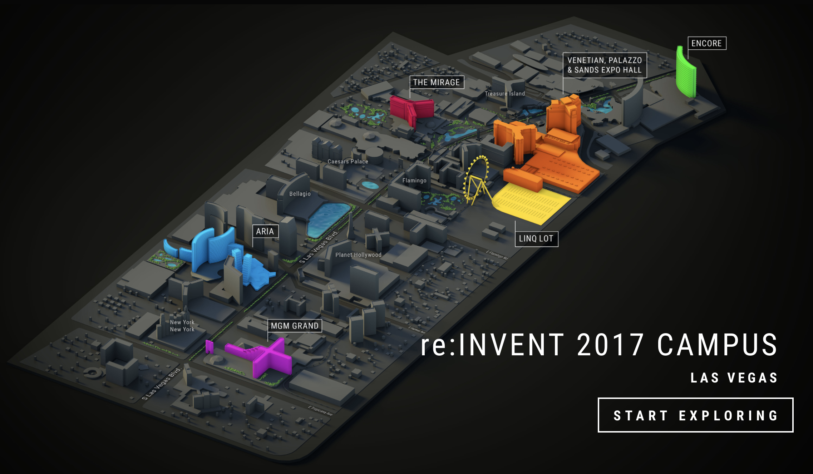

<section data-state="no-title-footer">
<!-- .slide: data-background="images/back_title.jpg" -->

## Recap 2017 
### Docker Meetup Bamberg 

 Govinda Fichtner, Chief Cloud Architect at Paessler AG 

 Bjoern Pohl, Senior Systems Engineer at Paessler AG

---

## AWS re:invent 2017 

* Biggest Conference regarding Cloud 
* took place in Las Vegas
* over 1.000 breakout sessions
* over 50.000 visitors 
* 5 days, 2 keynotes, too many parties to count

Note: talk about places etc

---

## Announcements

---

### Compute

* New instance types
  * m5 - multi purpose instances
  * h1 - high throughput, with ssd 
  * i3.metal - bare metal instances

* AWS Fargate
  * simplified container deployment

* AWS EKS
  * AWS managed Kubernetes

---

## Storage

* S3 Select
* Glacier Select

Only retrieve the Data you actually need

* can use standard SQL Statements to select data

---

## IOT

* Amazon FreeRTOS
  * based on FreeRTOS
* IOT Device Management
* AWS IOT Analytics
* AWS IOT 1-Click

---

## Machine Learning

* AWS DeepLens
  * Machine Learning enabled camera
* Amazon Comprehend
* Amazon Rekognition Video
  * Face detection, recognition

* Amazon SageMaker
  * simplified Machine Learning
* Amazon Translate
  * Language Translation
* Amazon Transcribe
  * Speech-to-text

---

## Databases

* Aurora Serverless
* Neptune
* DynamoDB now with global Tables
* On-Demand backups for DynamoDB

---

## Analytics

* Amazon Kinesis Video Streams

---

## Security, Identity and Compliance

* Amazon GuardDuty

---

## Networking and Content delivery

* PrivateLink

---

## Mobile Services

* AWS AppSync

---

## Media Services

* AWS Elemental
  * encode Media in the cloud

---

## Augmented Reality / VR

* Sumerian

---

## Application Integration

* AmazonMQ 

---

## Management Tools

* AWS Systems Manager

---

## Developer Tools

* Cloud9 IDE

---

#Thanks!

* https://github.com/McSlow/AWS-reInvent-Recap 

